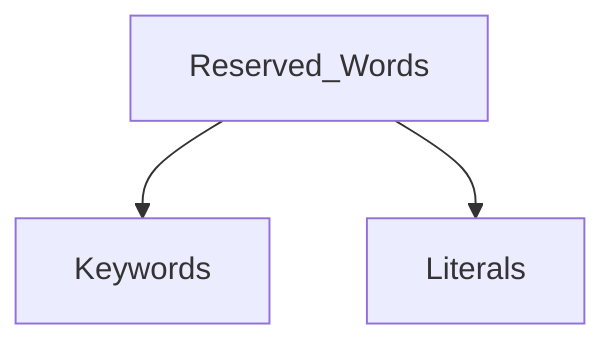

## Identifiers

**Identifiers in Java** are symbolic names used for identification. 
A identifier can be class name, method name, variable name or label

```java
public class Test
{
    public static void main(String\[\] args)
    {
        int a = 20;
    }
}
```

Above code have 5 identifiers - 
- **Test** - class name
- **main** - method name
- **String** - predefined class name
- **args** - variable name
- **a** - variable name

### Rules for defining Identifiers

- [A-Z], [a-z], [0-9]
- can't start with [0-9]
- are case sensitive.
- no limit of identifiers length but should be in between 4 - 15 letters length
- Reserved words can't be used as an identifier. there are 52 reserved words.

---

## Reserved Words
Words that represents the core functionality of the language.

or

Words that have predefined meaning to the language.

types - 



Keywords define *functionalities* and literals define *a value*

`for`,  `if` etc are keywords
`true` , `false` and `null` are literals. 

[more info](https://docs.oracle.com/javase/specs/jls/se11/html/jls-3.html#jls-3.9)

[List of Keywords](https://ibb.co/1ZQ7mPq)

*`const` are also a keyword but it is not used and has no function. And same for `goto`. for defining constants use `final` keyword.*

- Before JAVA 9 `_` can be used as a variable name but it now becomes a keyword and can't we used as a variable name.
---