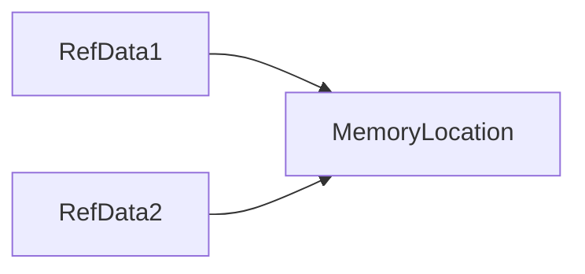

### Types
- *Primitive*  - such as boolean, char, int, short, byte, long, float, and double.
- *Non-Primitive* - such as String, Array etc.

#### Primitive
Primitive data are only single values and have no special capabilities.
Data in this type can't be divide further.

| data type | syntax | size | possible values | default value |
| --- | --- | --- | --- | --- |
| `boolean`|`boolean $NAME;`|1 bit|`true` or `false`|`false`|
| `byte`|`byte $NAME;`|1 byte (8 bits)|`-128` to `127`|`0`|
| `short`|`short $NAME;`|2 byte (16 bits)|`-32768` to `32767`|`0`|
| `int`|`int $NAME;`|4 byte (32 bits)|`-2147483648` to `2147483647`|`0`|
| `long`|`long $NAME;`|8 byte (64 bits)|`-9223372036854775808` to `9223372036854775807`|`0`|
| `float`|`float $NAME;`|4 byte (32 bits)| upto 7 decimal digits |`0.0`|
| `double`|`double $NAME;`|8 byte (64 bits)|upto 16 decimal digits|`0.0`|
| `char`|`char $NAME;`|2 byte (16 bits)|`\u0000`(0) to `\uffff`(65535)|`\u0000`|

`char` in other languages like C, C++ etc is only 1 byte because these languages follows ASCII Code system but Java uses Unicode system.

_**Unicode** defines a full international character set that can represent most of the world's written languages like Latin, Greek, Cyrillic, Arabic and many more._

Note:- `$NAME` is the variable name.

---

#### Non Primitive Data type

These data types also called **Reference Data Types** because they only store the memory location of the variable not the actual value.

A **reference type** is a **data type** that's based on a class rather than on one of the primitive types that are built in to the Java language



Suppose when you deal with *primitive* data types

```cpp
int a = 12; // stores 12
int b = a;  // a value copied to variable b
```

In the above case number `12` is stored in 2 different locations.

Whereas in *reference* data type, both variables points to same memory location.

Data types in this type is below :-

1. String
2. Class
3. Object
4. Interface
5. Array

